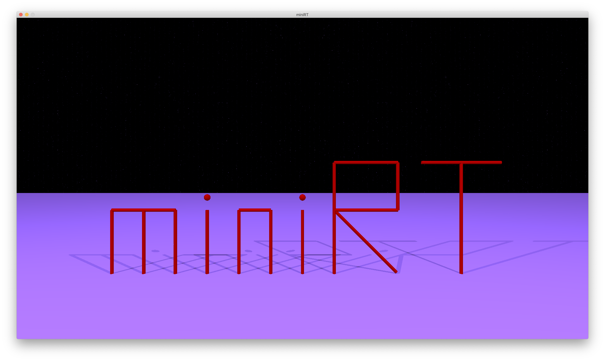
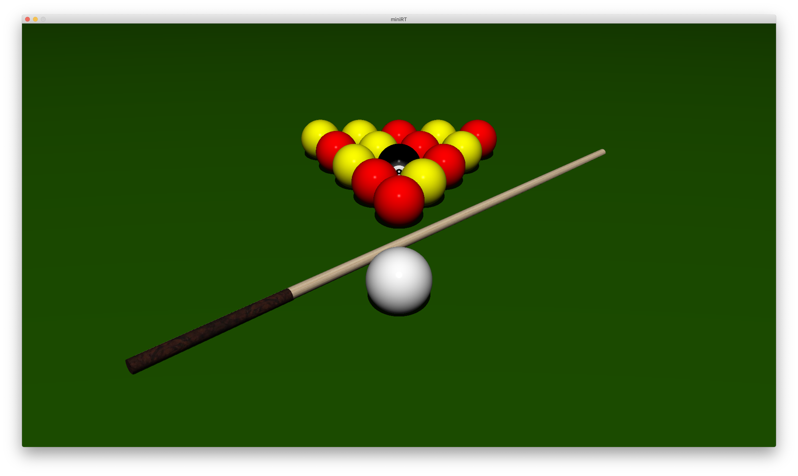
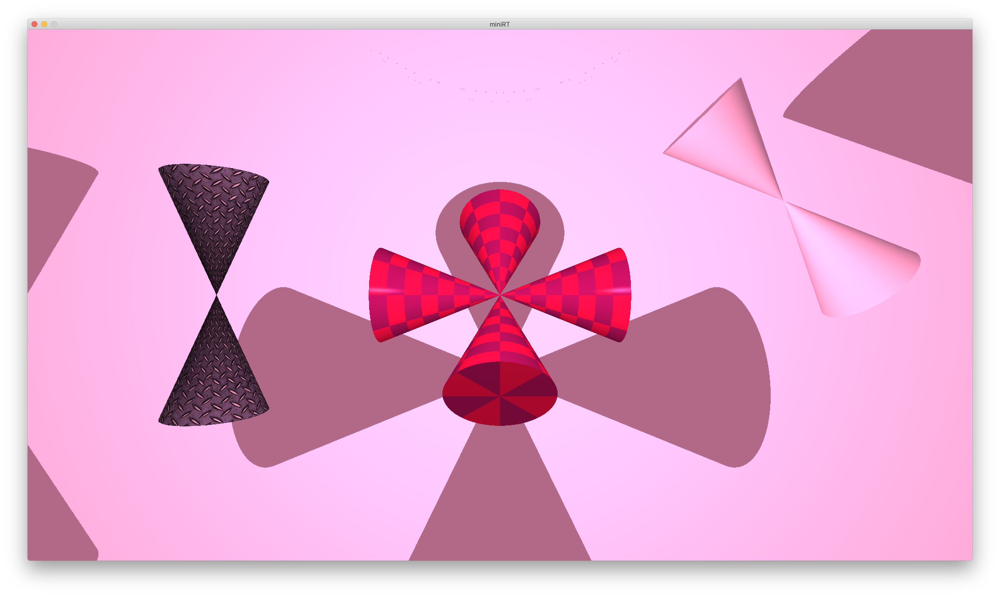
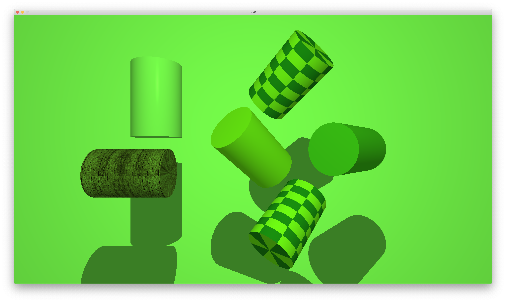
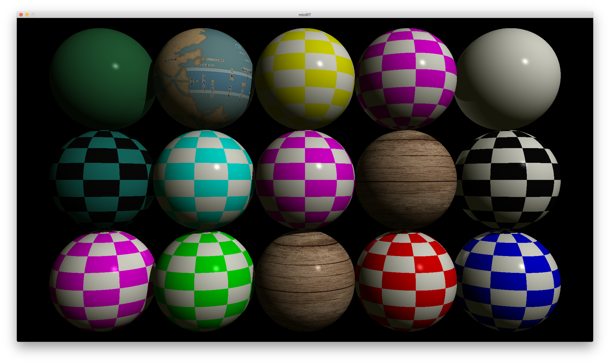

## prerequisites:
glfw:
```bash
brew install glfw
```
## build:
```bash
make
```
## run:
```bash
./miniRT [scene_file]
```
# scene_file format:
Ambient light:
```r
A (ratio) (color[r,g,b])
---
A 0.2 255,255,255
```

Camera:
```r
C (position[x,y,z]) (view-direction[x,y,z]) (fov)
---
C 0,0,0 0,0,1 90
```

Light:
```r
L (position[x,y,z]) (brightness) (color[r,g,b])
---
L 0,0,0 0.2 255,255,255
```

Sphere:
```r
sp (position[x,y,z]) (diameter) (color[r,g,b]) (phong-values[shininess,deffuse,specular]) {optional: texture[tx:path_to_texture] | checkerboard[ch:secondary_color[r,g,b]]}
---
sp -4,02,5 2 39,107,64 200,1,0.5
sp -2,02,5 2 255,255,255 200,1,0   tx:textures/wood.png
sp 04,02,5 2 255,255,255 200,1,0.5 ch:10,10,255,255,255
```

Plane:
```r
pl (position[x,y,z]) (normal[x,y,z]) (color[r,g,b]) (phong-values[shininess,deffuse,specular]) {optional: texture[tx:path_to_texture] | checkerboard[ch:secondary_color[r,g,b]]}
---
pl 0,0,0 0,0,1 255,255,255 200,1,0.5
pl 0,0,0 0,0,1 255,255,255 200,1,0   tx:textures/wood.png
pl 0,0,0 0,0,1 255,255,255 200,1,0.5 ch:10,10,255,255,255
```

Cylinder:
```r
cy (position[x,y,z]) (normal[x,y,z]) (diameter) (height) (color[r,g,b]) (phong-values[shininess,deffuse,specular]) {optional: texture[tx:path_to_texture] | checkerboard[ch:secondary_color[r,g,b]]}
---
cy 0,0,0 0,0,1 2 5 255,255,255 200,1,0.5
cy 0,0,0 0,0,1 2 5 255,255,255 200,1,0   tx:textures/wood.png
cy 0,0,0 0,0,1 2 5 255,255,255 200,1,0.5 ch:10,10,255,255,255
```

Cone:
```r
# double-sided
cn (position[x,y,z]) (normal[x,y,z]) (angle) (height) (color[r,g,b]) (phong-values[shininess,deffuse,specular]) {optional: texture[tx:path_to_texture] | checkerboard[ch:secondary_color[r,g,b]]}

# single-sided
cnh (position[x,y,z]) (normal[x,y,z]) (angle) (height) (color[r,g,b]) (phong-values[shininess,deffuse,specular]) {optional: texture[tx:path_to_texture] | checkerboard[ch:secondary_color[r,g,b]]}
---
cn 0,0,0 0,0,1 30 5 255,255,255 200,1,0.5
cn 0,0,0 0,0,1 30 5 255,255,255 200,1,0   tx:textures/wood.png
cn 0,0,0 0,0,1 30 5 255,255,255 200,1,0.5 ch:10,10,255,255,255
```


<!-- add images from img folder -->







